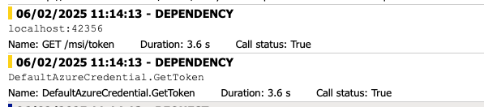

# Debug Job latency

## Description

The goal of this project is to recreate job latency during the startup procedure between azure container app job and sql server.

## Prerequisites

- Azure subscription
- Azure CLI
- PowerShell

## Steps

### Deploy the base resources

```powershell
./base.ps1 myproject northeurope tenant-id subscription-id
```

This script will create the following resources:

- Resource group

## Deploy the infrastructure

```powershell
./infrastructure.ps1 myproject northeurope
```

This script will create the following resources:

- Log Analytics Workspace
- Application Insights
- Azure Container Registry
- Container App Environment
- Sql Server
- Sql Database
- Managed Identity
- AcrPull role assignment

## Allow the container app to access the sql server

1) Open the azure portal and add your account to the `Microsoft Entra ID` admin.


2) Login to the sql server and create a new user with the following query:

```sql
CREATE USER [manage-identity-name] FROM EXTERNAL PROVIDER;
ALTER ROLE db_datareader ADD MEMBER [manage-identity-name];
ALTER ROLE db_datawriter ADD MEMBER [manage-identity-name];
ALTER ROLE db_ddladmin ADD MEMBER [manage-identity-name];
GO
```

## Deploy the container app

```powershell
./container-app.ps1 myproject northeurope
```

## Observe the job latency

1) Open the azure portal and navigate to the `Application insights`.
2) Open the `Transactions search` blade.

You can observe the job latency :



## Clean up

```powershell
./clean.ps1 myproject northeurope
```
